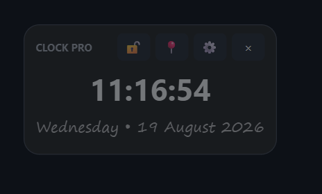

# Always-on-top-desktop-clock
A lightweight, customizable **always-on-top desktop clock for Windows**.

## 💡 Why I Created This

While using my Windows laptop, I wanted to keep a clock visible on the screen while working, studying, or using other applications.

However, I found that many existing desktop clock solutions were either too complicated, used too many resources, had unnecessary features, or did not provide the level of customization and control I wanted.

I wanted a simple clock that could:

- Stay visible above other applications
- Be moved anywhere on the screen
- Be locked in a fixed position
- Allow complete control over its appearance
- Let me change the font, size, colors, and transparency
- Stay lightweight and use minimal system resources

So I decided to build my own **Always-on-top Desktop Clock** focused on simplicity, customization, and low resource usage.

## 🎯 Goal

The goal of this project is to provide a simple, lightweight, and customizable desktop clock for Windows without unnecessary features or complexity.

## ✨ Features

* 🕐 Always-on-top clock
* 🖱️ Drag the clock anywhere on the screen
* 🔒 Lock / unlock the clock position
* 📌 Always-on-top toggle
* 🕐 12-hour / 24-hour format
* 🔢 Show / hide seconds
* 📅 Show / hide date
* 🎨 Custom clock and date colors
* 🔤 Custom fonts
* 🔠 Adjustable font size
* 🌫️ Adjustable transparency
* 📐 Adjustable widget size
* 💾 Automatically saves your position and settings
* 🪶 Lightweight and simple

## 📸 Screenshot

<p align="center">
  
</p>

## 📥 Download

Download the latest Windows version from the **[Releases](../../releases)** section.

### Windows Installation

1. Download the latest ZIP from Releases.
2. Extract the ZIP.
3. Open the extracted folder.
4. Run `ClockPro.exe`.

## 🛠️ Run from Source

Make sure Python is installed.

Install the required package:

```bash
pip install -r requirements.txt
```

Run the application:

```bash
python clock_pro.py
```

## 🏗️ Build the Windows EXE

Run:

```text
build.bat
```

The executable will be created in:

```text
dist/ClockPro.exe
```

## 🎨 Customization

Click the **⚙ Settings** button to customize:

* Time font
* Time font size
* Date font
* Date font size
* Time color
* Date color
* Background color
* Transparency
* Widget width
* Widget height
* 12-hour / 24-hour format
* Seconds visibility
* Date visibility

## 🖱️ Controls

| Button | Function              |
| ------ | --------------------- |
| 🔓     | Unlock and drag       |
| 🔒     | Lock position         |
| 📌     | Enable always on top  |
| 📍     | Disable always on top |
| ⚙      | Open customization    |
| ×      | Close application     |

## 💻 Requirements

* Windows 10 / 11
* Python 3.x (only required when running from source)

The standalone Windows release does not require Python.

## 📦 Project Structure

```text
Always-on-top-desktop-clock/
│
├── clock_pro.py
├── requirements.txt
├── run.bat
├── build.bat
├── README.md
└── LICENSE
```

## 📄 License

This project is licensed under the **MIT License**.

---

Made with ❤️ for Windows.
